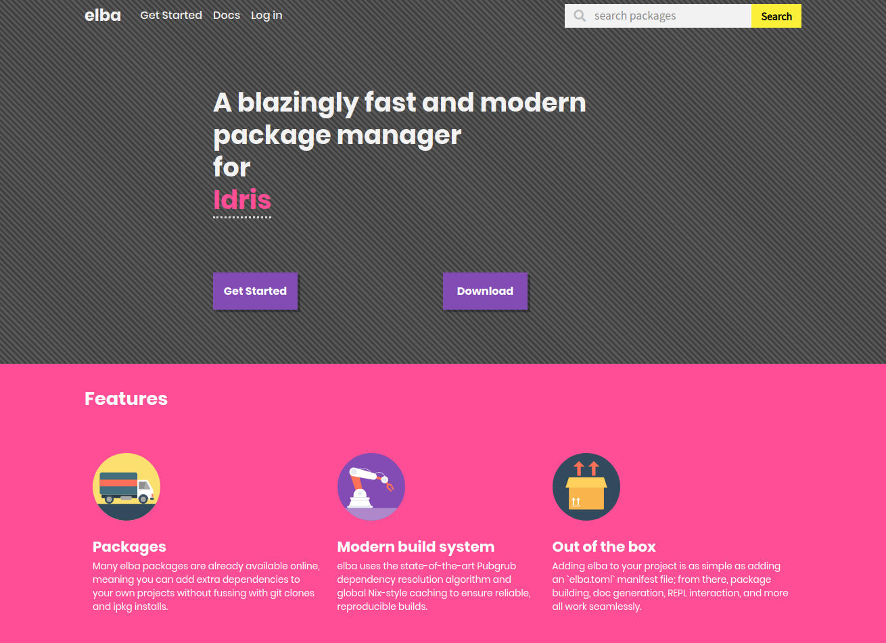

[elba](https://github.com/elba/elba) is a new-ish package manager for
the [Idris programming language](https://www.idris-lang.org/). Over the
past few months, there has been slow but steady progress towards making
elba a more robust package manager that can play in the big leagues.
Now, around a year since the initial commit to the elba repo, I can
confidently say that elba is kinda-sorta-maybe-almost there! With a new
point release and a new, fancy-shmancy, extremely artisanal website,
elba is now Production Ready(tm).

# elba.pub



Nothing screams "production ready" like a fancy website, and now, elba
has one, located at [elba.pub](https://www.elba.pub)! Work on this part
of the project has been spearheaded by [**Lok Andy (@andylokandy)**]
(https://github.com/andylokandy) and assisted by [**Andrés Rodríguez
(@mixedCase)**](https://github.com/mixedCase) - without them, there'd be
no elba.pub!

This website serves several purposes:

## Uploading a package

With a hosted server backed by Amazon S3 storage, we can store packages
on a package server! Package creators can choose to upload their
packages to the elba.pub repository through a fairly streamlined
process:

- Log into elba.pub using a Github account
- Get a token
- `elba login <token>`
- `cd project && elba publish`

(note that package namespaces are first-come, first-serve: once a user
uploads a package to a namespace, it's theirs, forever.)

See [the docs](https://elba.readthedocs.io/en/latest/usage/publishing.html)
for more info.

## Browsing packages

Like any other big-name package repository, elba.pub has a pretty face
which you can use to search for and find info about various packages.

Additionally, package searching functionality is available from the
command line. Just whack `elba search <query>` to fuzzy-find a package.

## Depending on packages

As a package consumer, you can now just depend on a version of a
package, instead of having to specify a git repo:

```toml
[dependencies]
"dcao/hello" = 0.1.0
```

This also means that the Pubgrub dependency resolution system which
elba uses will finally be put to use, ensuring that dependency
resolution is fast and produces pretty error messages.

elba's versioning system has its own idiosyncrasies which you might
want to familiarize yourself with: as always, [the docs are your friend]
(https://elba.readthedocs.io/en/latest/reference/dependencies.html).

# The 0.3.0 release

If you want a brief list of everything changed with 0.3.0, feel free to
take a gander at
[the changelog](https://github.com/elba/elba/blob/master/CHANGELOG.md).
Rather than enumerate every single change here, I'll note larger
improvements.

## Improved registry functionality

In order to coincide with the release of elba.pub, elba-the-cli has
a bunch of new subcommands and manifest fields for interacting with
package registries; this includes the ability to `publish` and `yank`
packages, `search` through packages in an index, and `login` to a
package registry.

## Scripts and hooks

With this release, packages can now declare **scripts**, which are
arbitrary shell commands runnable in the project directory via
`elba script <script_name>`:

```toml
[scripts]
prebuild = "echo 'I'm building now!'"
fail = "exit 1"
```

Additionally, certain scripts (currently only `prebuild`) are
automatically run during the build and install process; these are
called **hooks**, and they can make for some pretty powerful
behavior. For instance, if you want to check for the presence of a
binary on a build system, you can do so with the `prebuild` hook,
exiting with a non-zero return code to error out of building this
package.

## Experimental Blodwen support

This release adds some basic support for Blodwen (aka Idris 2). A
new config variable, `compiler`, has been added. If you set this to
the path of a Blodwen executable, elba will switch its build process
to be Blodwen-compatible. However, due to restrictions with the Blodwen
compiler, there are some caveats:

- `elba repl` doesn't work due to the inability to add multiple source
paths
- Doc generation doesn't work
- Library codegen doesn't work

This release also lays the groundwork for more robust Idris 2 support
in the future. For instance, this release has added the concept of a
"virtual package," which has no build targets. In the future, a virtual
package `idris/idris` could be created, with different versions of the
package checking for the presence of a certain version of the compiler
via hooks.
