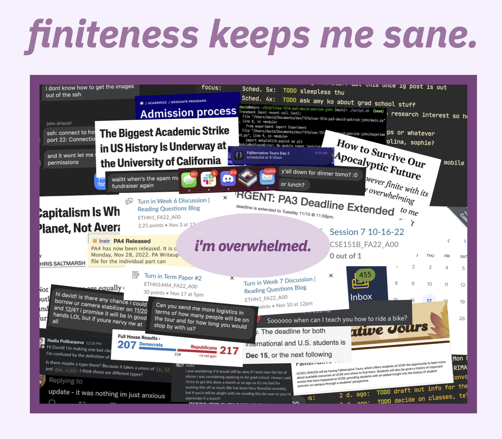
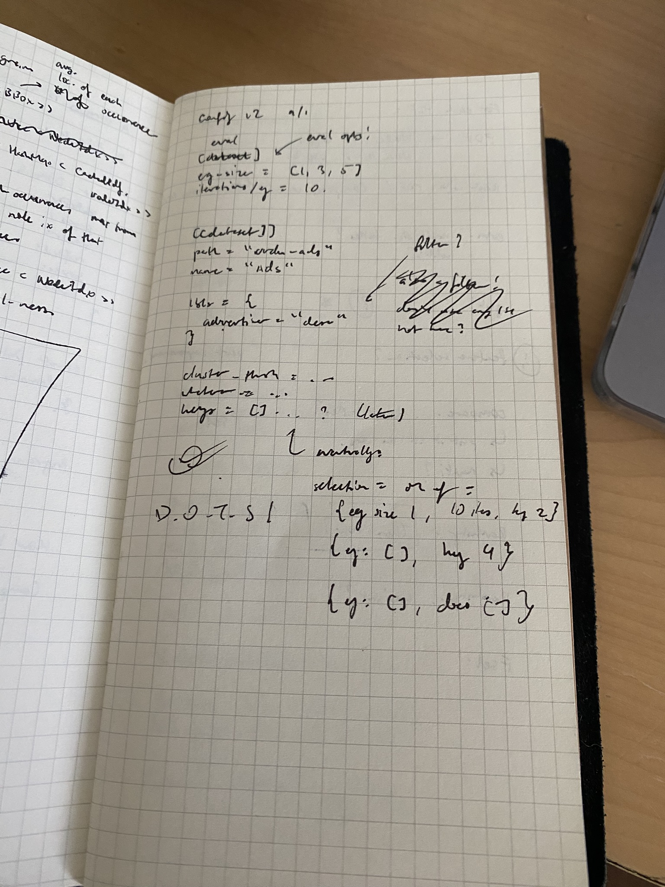
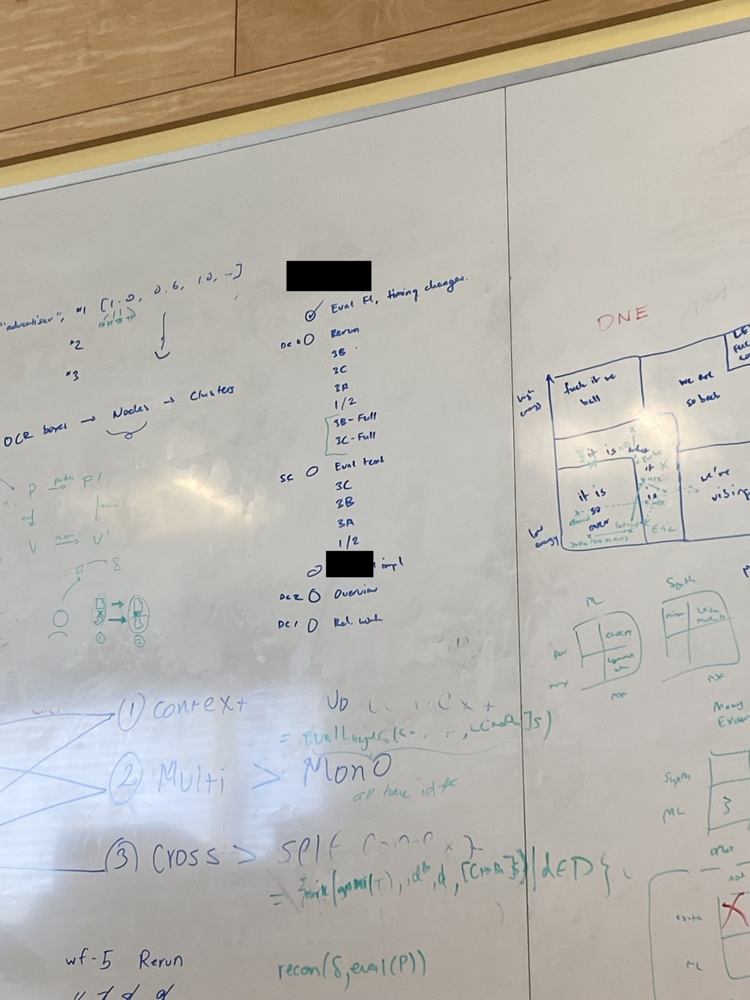
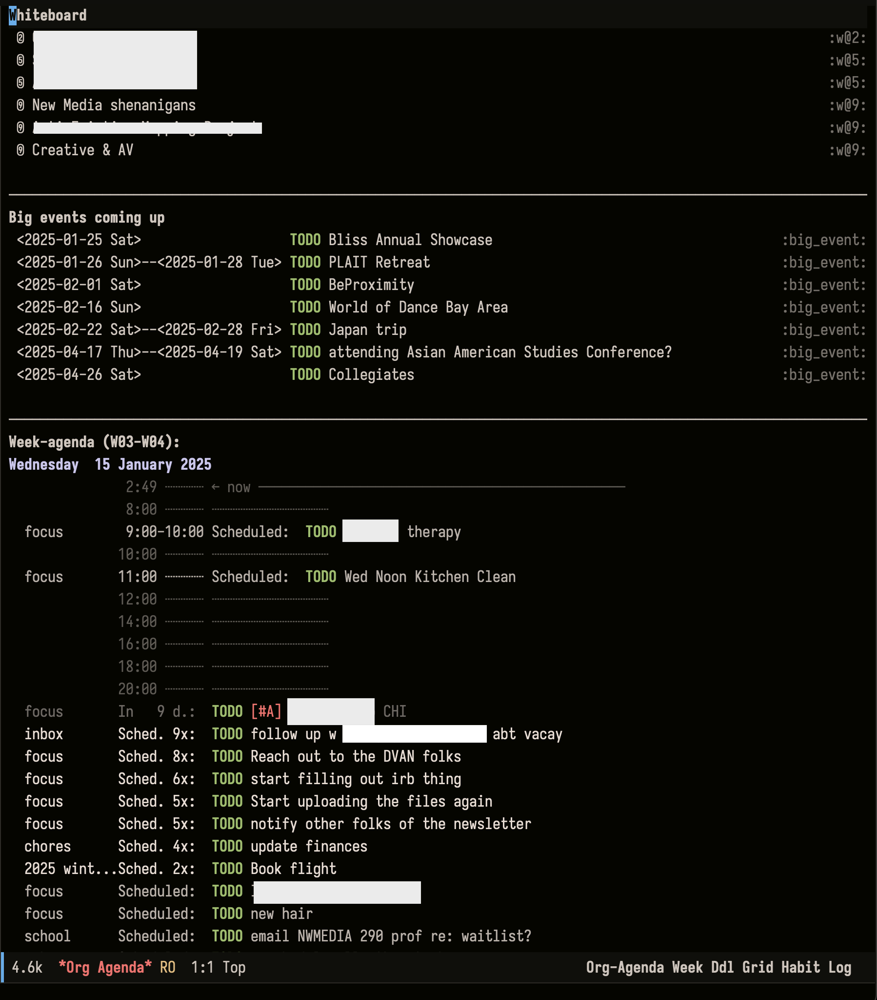
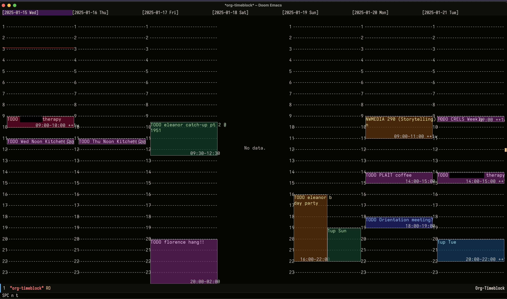
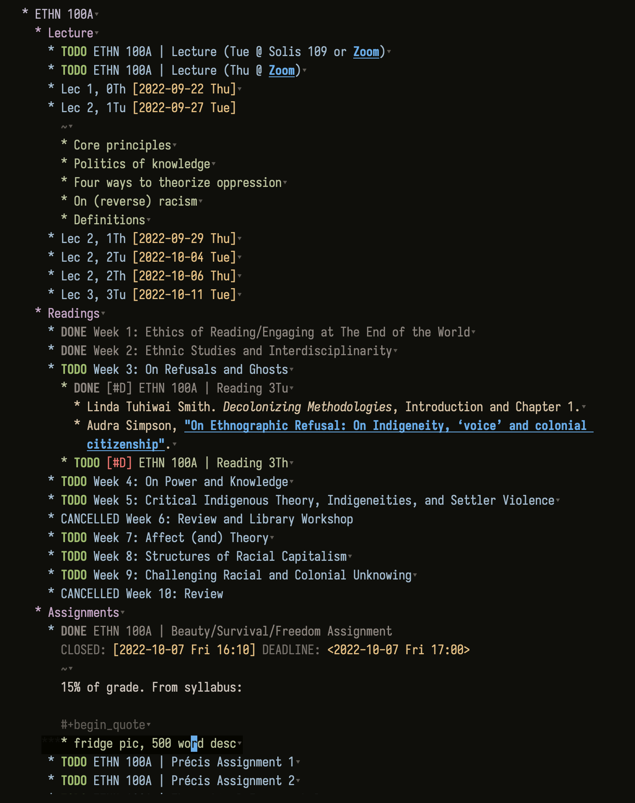
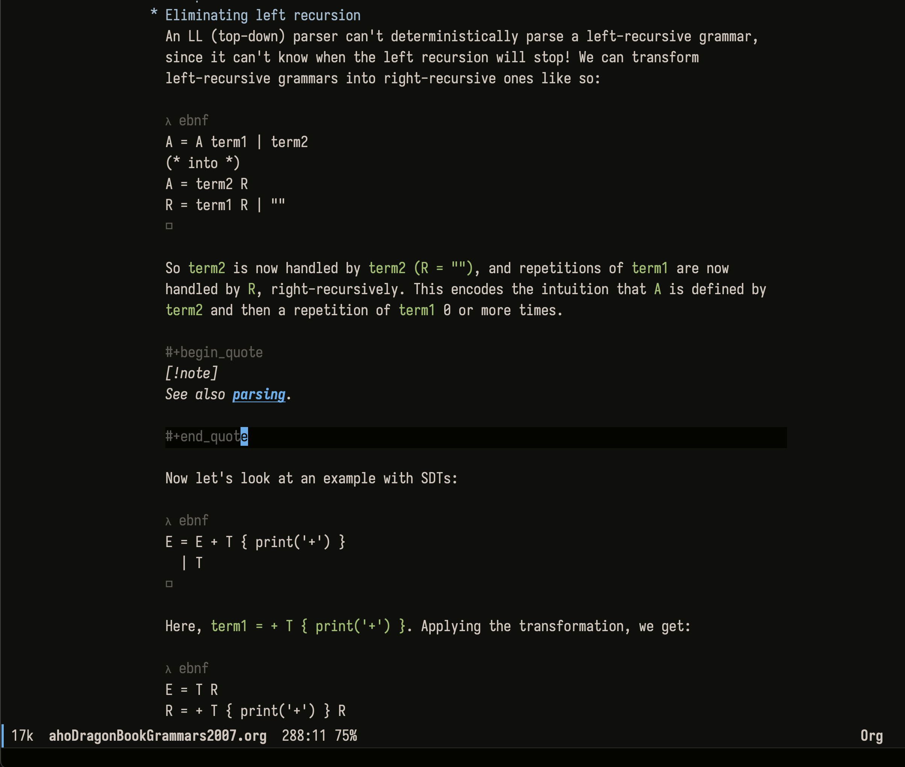
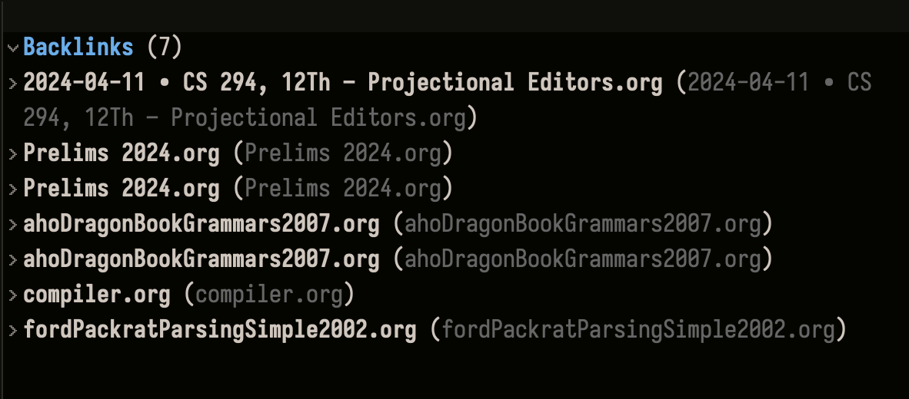
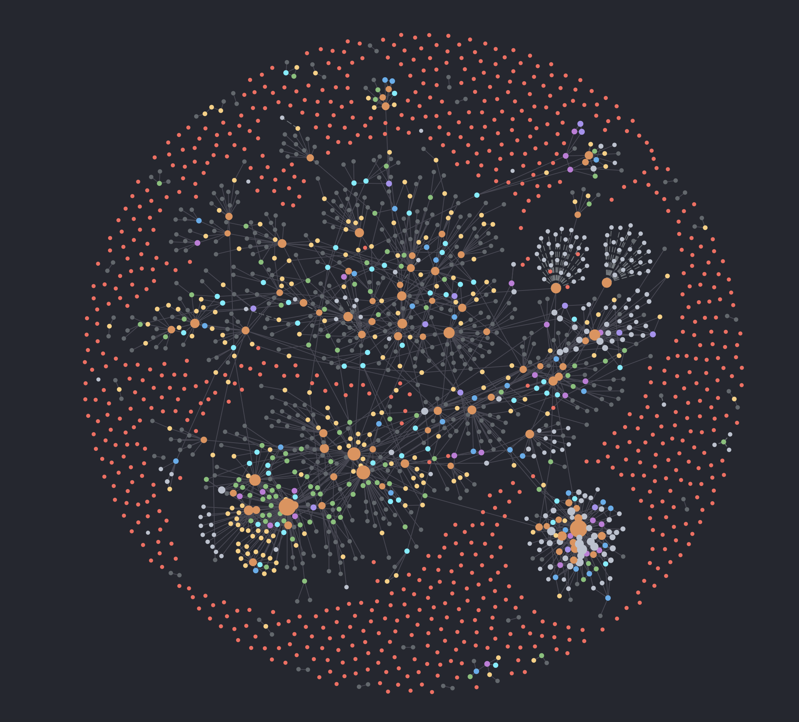
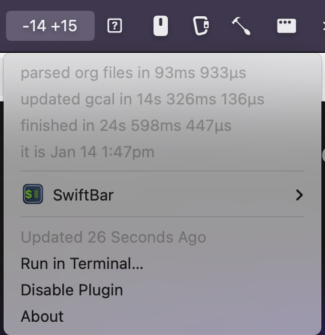

<!-- vim: set tw=72 wrapmargin=0 formatoptions+=t: -->

<aside>
    
    <p class="mt-2">
        This blog post began as a presentation I gave in fall 2022 at
        <a href="https://spaces.ucsd.edu/">SPACES</a>,
        the student-led resource center I worked at while at UCSD.
        This first slide shows a selection of things I was concerned
        with at the time: academics, grad apps, and the then-ongoing UC
        graduate workers strike, to name a few.
    </p>
</aside>

My early 20s have been a lot.<sup><em>[citation needed]</em></sup>

I grew up in the Bay, and so coming back here for my PhD has brought out
my inner child in ways I'm continuing to grapple with and process.
Preventing myself from just becoming me in high school is a daily
challenge. On top of that, building a new support network and finding my
communities here has been incredibly rewarding, but also scary and
anxiety-inducing at times---what if folks don't like me or get a bad
impression of me? This is while I've also been navigating how to
maintain my existing now-long-distance friendships and grow them beyond
catching up once every quarter. And realizing self-actualization in this
space---reconnecting with my cultural background and interrogating the
politics and vibes of my research work---has been a lot too.

These large-scale concerns create a deluge of little things I need to
keep track of in the day-to-day. I have class deadlines on ~~Canvas~~
bCourses I need to keep track of, self-directed research projects that I
need to schedule and pace myself on, meetings I have to block out time
for, errands I have to run, friends both prospective and well-known
whose texts I've left on delivered for days and need to reply to,
important emails I don't even know exist that I need to triage, hobbies
and outside passions I need to make time for, *and* internal thoughts on
all of this that I need to journal and process.

On top of that, late-stage capitalism fucking sucks, and finding space
for joy and leisure while bearing (witness to) the everyday violences of
white supremacy, capitalism, and colonialism is a lot. My tax dollars
fund genocide, climate catastrophe marches on unabated, and tech
companies are too busy building themselves fake AI friends because they
don't have any real ones, yet I still gotta Lock In because I have an
assignment due at 11:59.

Needless to say, I get overwhelmed sometimes.

In these trying times, my silly little notes apps are how I keep myself
sane. If I have a bunch of big overwhelming projects I need to work
on, breaking them down into small, manageable, actionable tasks helps
keep me grounded. If I have a bunch of thoughts and feelings swimming
around in my head, writing them down somewhere gives me peace of mind
knowing that there's somewhere I can reference them and I don't have to
spend more brain energy keeping it in my own head.

<aside>
    
</aside>

I like to imagine my notes system like *a box*. Without a notes system,
my obligations and thoughts feel infinite and overwhelming. But if I can
put them all into a box, if I know exactly what I need to do and when I
need to do it, everything feels more in control. I have a finite list of
things to do I can point to, and there's nothing outside the box to do.
I got this. *Everything will be okay.*

This blog post is a little bit of everything:

- It's a *manifesto* on the personal, political reasons of why I care
  about notes apps so much (and why I think you should care too!);
- It's a *guide* to the various kinds of apps, interventions, and
  systems out there;
- It's a *showcase* of my personal notes system---the philosophy and
  style of how I organize my notes, and the cool things my system lets
  me do.

# CYA

Before we keep moving, I have some caveats I want to touch on first.

## It's not you, it's me

Notes apps are deeply personal things. Folks are putting their deepest
and darkest secrets in the Apple Notes app as we speak. The systems
folks use to take notes, to keep track of things to do---these are a
reification of how they see the world!

All of my thoughts below---including how I deal with and conceptualize
my anxiety and stress---is just for me. Maybe none of this works for
you, and that's okay! However you conceptualize and manage stress and
anxiety and overwhelming stuff in your own life, whatever works for you
is totally valid! Everyone's brain works a lil differently, and the way
that works for you is the way that works for you.

If there's one takeaway I want you to have from this article, it's this:
everyone's brain is different, and people's knowledge management
systems---the *boxes* they use to process the world---should fit their
brains. Find a system that works for you and your brain in a particular
context! And don't be afraid to adapt it to your current vibes. No notes
app will fit your brain perfectly---you'll have to play around and see
which apps are amenable to being molded to work with your brain!

## This is not an endorsement of capitalism

One of the ✨silly and goofy✨ aspects of our capitalist hell is that it
sells you band-aid solutions that superficially address (but actually
worsen) the systemic violences it enacts. Feeling a deep sense of ennui
and alienation from your labor? Here's a meditation app you can
subscribe to!
<span class="aside"> Lots of folks have written on the co-opting of
self-care;
<a href="https://read.dukeupress.edu/south-atlantic-quarterly/article-abstract/120/2/325/173307/Reclaiming-the-Radical-Politics-of-Self-CareA-Crip?redirectedFrom=fulltext">"Reclaiming the Radical Politics of Self-Care: A Crip-of-Color Critique"</a>
by Jina
Kim and Sami Schalk is my favorite treatment of this right now.
</span>

And so it goes with notes apps. 

These days, numerous companies and startups have popped out of the
woodwork, looking to sell you Free Time As A Service. These tools all
speak a particular kind of language, looking to ["optimize" your
schedule](https://reclaim.ai/) or
"[maximize](https://www.notion.com/use-case/time-management)
[productivity](https://www.usemotion.com/)."

<aside>
<p>
Obviously, this is not the case with <em>every</em> digital
organizational tool. However, this kind of framing and marketing does
tend to be particularly common with (1) tools marketed for business use,
and/or (2) tools backed by VC funding. Go figure!
</p>

<p> There are certainly diversions from this kind of rhetoric. For
example, the use of the term <a href="https://maggieappleton.com/garden-history">"digital garden"</a> to
refer to personal wikis and knowledge bases emphasizes the practice of
knowledge organization as a kind of self-care, like tending to a
garden&mdash;a personal practice and art that can be enjoyed for its own
sake.
</p>
</aside>

These are tools marketed as
ways to cope with the imperatives of capital, yet they are still
beholden to its syntax and semantics, seeing themselves as valuable only
insofar as they enable you to do more work or make creative output [more
dependable and reproducible](https://www.linkingyourthinking.com/), as
if we are all Henry Ford looking to assembly line our brains into order.
I am no longer a person trying to live an introspective, fulfilling, and
restful life. I'm a [*knowledge worker*](https://logseq.com/),
apparently.

These apps are full of the same Silicon Valley bullshit that has become
inescapable in the rest of our lives. All this info is stuck in whatever
bullshit cloud these companies want to lock my data away in, because
heaven forbid my data outlasts the 5 years these companies last before
their VC funding runs out. And why do I want AI turning my notes into
["actionable insights??"](https://www.notion.com/product/ai) What the
*fuck*?

Relatedly, a whole subculture of folks focused on "productivity" has
sprung up around these tools. Influencers show off their perfectly
curated Notions that they use to plan out their content schedule.
Academics and students on TikTok talking about how they use these tools,
proclaiming that this "one simple trick" got them all A's in their
classes.

---

I want to be very clear. I am not interested in valorizing productivity,
and I sure as hell don't want to *optimize* or *maximize* anything.

I don't want my tools to let me do more work. I want my tools to bring
*joy* into my life. These are tools to let me do things I enjoy and
spend time with folks I love---making space for joy and leisure in the
midst of the bullshit that is productivity culture and capitalism.

<!-- notes apps as critical resistance -->

# What works for my brain

A notes system consists of notes that are stored in some place (e.g., an
app on your computer or phone or pieces of paper in a box somewhere) and
have some kind of organizational structure imposed on them. I've spent
years iterating on my own knowledge management system, switching between
various apps, trying things out, and building a taxonomy for my
knowledge that fits my brain. 

Through this process, I've been able to narrow down exactly what I look
for in my notes systems.

The goal of my personal notes system is to move thoughts out of my head
and into somewhere tangible so I can stop thinking about it. Time spent
thinking about tasks I might(?) have to do or notes I need to remember
is time spent not being present. The faster I can get things out of my
head and into the system, the better.

My notes system should let me organize all of these thoughts in a
structured way, letting me keep track of what I have to do and all of
the resources I need to do these things. It should be a kind of *second
brain* that can help do some thinking for me.

To satisfy these use cases, I need a notes system that is __fast,
flexible, and fun__.

## Fast

My first organizational tool was a weekly agenda, given to me for free
by my high school. I used it to record deadlines for assignments and
schedule events and work sessions, and it was pivotal in allowing me to
survive Fremont, California.

The reason this agenda was so useful to me was that it was so damn
convenient to record information in it. If a deadline popped into my
head, my agenda could be out and recording that info in seconds. I could
keep the agenda on me at all times and be able to record and reference
these deadlines whenever, wherever. And handwritten resources are still
a key part of my system today---I use notebooks and whiteboards as
drafting spaces for quickly listing down tasks for the day or drafting
out ideas:

<div class="flex mb-4 flex-row gap-2">


</div>

A notes system should be *fast* to both read *and* write information:

- It should be fast to *capture* information into my system. I'm
  scatterbrained and anxious; if a thought comes into my head, I need to
  get it out of my head and into the system ASAP. This includes how long
  it takes to open the system, how long it takes to decide where the
  right place for the information is (and put it there), and even how
  laggy or responsive the system is when I'm writing information down.
  And of course, I need to be able to do this from anywhere, including
  when I only have access to a phone, and including when the UC Berkeley
  WiFi starts acting up again.
- It should be fast to *navigate* the system. The system should let me
  organize my notes in a way that lets me easily find them. The system
  should have affordances that allow me to navigate throughout my notes
  quickly---e.g., keyboard shortcuts and commands for quickly moving
  through a note or set of notes.

A system can't be relied on if it's not fast. If a system introduces
roadblocks to inserting, moving, or locating information, I start
hesitating when using the system. If I hesitate when using the system, I
start doubting whether I want to use the system. Once I start doubting
if I want to use the system, it ceases to be useful; I can't offload my
brain into it anymore.

With the agenda, while it was certainly fast to jot down and retrieve
information, editing existing information often proved to be cumbersome,
requiring erasing and moving around of different handwritten entries.
This is a critique I have in general of handwriting-based systems like
[bullet journaling](https://bulletjournal.com/), though of course, your
mileage may vary.

## Flexible

As I started exploring the world of digital knowledge management tools,
I found that lots of tools were very good at one specific kind of task:

- *todo list apps* like Todoist and Apple Reminders are very good at
  recording one-off tasks like errands and homework assignments;
- *calendar apps* like Google Calendar are good for blocking out your
  schedule and juggling meetings and events;
- *note-taking apps* like OneNote, Evernote, and the Notes app let you
  do just that: take notes!

However, I don't know about y'all, but I don't separate my brain in this
kind of way. My tasks include notes, my notes include calendar events,
and my calendar events have tasks; and to be honest, I don't really
distinguish between these things in my head. A meeting for a research
project might have notes on the meeting I want to record, subtasks I
need to delegate, and other follow-up meetings I need to timeblock
around. A reminder to schedule a hangout with a friend will turn into a
scheduled, timeblocked event with associated notes on what we're doing
and where we're going. These aren't things I would want in different
places!

Thus, one aspect of flexibility is that *a notes app shouldn't just be a
notes app*; it should be a todo list app and a calendar app too.

On top of that, different notes systems encourage you to organize your
thoughts in particular ways. For example, one of the first notes apps I
tried was an app called [*WorkFlowy*](https://workflowy.com/). This
app's special sauce was that it was an *infinite outliner*: it let you
create outlines as deep and nested as you wanted, and let you zoom in
and out of bullet points to focus in on particular parts of your notes:

<aside>
I originally got into this app because in high school we would be made
to write <em>Cornell Notes</em>, which are very heavy on outlining structure.
Lore!
</aside>

<video controls loop muted class="w-full mb-4">
    <source src="./workflowy-2.mp4">
</video> 

This genuinely changed my brain chemistry. The idea of having
everything---a note, a task, whatever---be a bullet point, and being
able to arbitrarily nested these bullet points within each other, spoke
to the "computer science is my passion" part of my brain, the left brain
in me that demanded to impose order onto the world around me. I was able
to break down big tasks and projects into manageable chunks, categorize
my tasks and notes under larger goals, and build a graspable taxonomy of
my information:

```
- Research
  - Goal: expand my academic community
    - Task 1
    - Task 2
    - ...
  - Goal: collaborate with folks on the ground
    - Project A
      - 2024-01-01 • Meeting notes
        - ...
      - Tasks
        - ...
```

However, I don't want *all* of my notes to be structured this way! While
my left-brain "everything must be organized" self enjoys this kind of
organizing very much, my right-brain "i'm quirky and scatterbrained and
✨interdisciplinary✨ and everything is connected" self doesn't really!
Many of the things in my life can't really be siloed away into one
category like this; [TODO add stuff here].

This side of me is drawn to apps like
[*Obsidian*](https://obsidian.md/), which are structured like a personal
Wikipedia---you structure your notes by creating *links* between
different notes, and you can see which notes have linked to other notes.

[TODO obsidian video].

This is the second aspect of flexibility: to be able to structure my
notes to have *both* strict and rigid hierarchies *and* looser
interlinked taxonomies.

## Fun

Most importantly, it should be a *joy to use the tool itself*. It should
feel *good* to take notes, to list out everything I have to do and check
it off one-by-one. It's hard to want to use the system to get my life
together, unless using the system *is itself* motivating---unless I want
to *live* in the system.

Good includes being fast and flexible. The tool should be fast and
responsive. Editing notes should be quick and precise. I shouldn't need
stable WiFi to use it. Good also means lots of other little things. It
should look reasonably pretty, and it should produce reasonably pretty
notes.

The most important part of "good," though, is that if the system doesn't
do something I want it to do, *I can fix it myself.* Keyboard shortcut
isn't doing what I expect it to do? I can add it myself. Do I have a
particular system for archiving old notes I want to use? Let me program
that into the tool. There is nothing as joyful as using a tool that
doesn't demand that I change for the tool, that just does what I expect
it to do, every time.

Because many of the aforementioned tools are hosted by other people, you
*cannot* meaningfully modify or customize them. Sure, you can decorate
your Notion with aesthetic images and a nice colorscheme, and if you're
enough of a Notion wizard, you can do some fun stuff with formulas and
all that. But fundamentally, what you can do in Notion is dictated by
the Notion developers. You have no access to the underlying system, its
code, or your data.

The machinations of capital constrain both the discursive and material
dimensions of many of these tools. As mentioned above, the rhetorics of
capital insist that tools for "productivity" are only valuable if they
can make you more valuable to capitalism, as measured through hours
worked or tasks completed. Moreover, the *material* demands of capital
require that these tools' developers subvert your autonomy, locking away
their tools from customization and your data from unencumbered access.

To insist on the *joyfulness* of our tools is to reject the discursive
and material demands of capital. Joyful tools eschew these rhetorics and
demand recognition of an unquantifiable virtue these tools can bring
us---happiness! And joyful tools require us to build and imagine
*materially* different systems---systems that are introspectable and
personal.

<!-- personal as opposed to wanting to scale for everyone? -->


# What I use

Finding the notes system that works for you is a deeply personal
process, and it's a process that takes lots of introspection and lots of
time. For me, when I was in my trying-different-things-out era, I would
put all of my notes and todos into an app for a week or so and see how I
felt, seeing what parts of the system spoke to me and what parts felt
bothersome or burdensome. Sometimes this process can take months or even
*years*---with Obsidian, I tried switching over to it 3 or 4 different
times, each time learning more about what I did and didn't like, and how
I could adapt the tool to suit my needs.

Using one of these apps is a conversation. When you switch to a system,
you are asking the tool to change for you, to fit how you process the
world and organize your perception of it. And in turn, the tool asks you
to change for it, subtly encouraging you to see the world through the
lens it provides. Outliners like WorkFlowy encourage you to impose
structure and hierarchy onto the world, while other apps like the Apple
Notes app encourage you to take the chaos of the world as it is.

My system is a little quirky. All of my notes are stored as text files
on my computer. Each of these text files (think of them like Word
documents basically) corresponds to a note. Each of these notes is
written in an outline format that looks like this:

```org
* Heading 1
** Heading 2
Some text for heading 2 goes here

** Heading 3
Whatever other text
```

To edit these files, I use an application called
[*org-mode*](https://orgmode.org/). *org-mode* was originally created in
2003 as a feature of a larger program called *Emacs*, which is a code
editor similar to Visual Studio Code.

This is an incredibly barebones setup, and yet it is this simplicity
that is the sauce of the system. These notes are regular degular text
files, meaning it is straightforward to build different tools that
programmatically interact with and view these files in different ways.
Not only does *org-mode* itself have a metric fuckton of different
features and keyboard shortcuts for interacting with these notes, but
*org-mode* and *Emacs* are themselves incredibly programmable and
extensible, meaning I and other folks can write additional layers of
functionality on top of this.

<aside>
For the computationally inclined among y'all who want more technical
info: I use Doom Emacs, and my config is on <a
href="https://github.com/dcao/dots2/tree/main/config-mut/doom">GitHub</a>
if you want to follow along. Additionally, I have written <a
href"https://github.com/dcao/org-tools">custom Rust tools</a> for
programmatically interacting with my notes, which I cover more below.
</aside>

This system is also highly amenable to archival and preservation. Online
services that store your notes can disappear at any point, taking your
notes with them. Since these notes are in a very simple, transparent
format, and since all of them are just on my computer, it's super easy
to preserve notes for a long time. My original notes from the start of
undergrad are still on my laptop!

As a disclaimer, I will say that this system is extremely quirky and
pretty rough to get into. I was first interested in this system in 2016,
and it took years of learning programming and banging my head against
the software to be able to switch to it when I entered UCSD in 2019. I
then gave up on it around 2021 because updates had broke the system, and
I took me *another* 3 years to get back into it again.

The reward is a system with such capacity that it's difficult to
describe without seeing examples. So let's see some examples :^)

<!--
## How I organize my notes

My notes folder contains the following sub-folders:

- The `lit/` folder contains *literature notes*---notes on readings and
  articles.
- The `calendar/` folder contains small journals and other random
  thoughts that come into my head---think notes you would make in the
  Notes app!
- The `reflections/` folder contains larger-scale reflections---I write
  very big reflections about once every year, and they're very helpful
  for me to reflect on the ups and downs of the year and intention set
  for the future!

All of my other notes go in my main notes folder.
-->

## Task management

The starting point for my notes setup is a file called `inbox.org`. This
is where I put one-off tasks that don't really belong anywhere else.
Think one-off hangouts with friends, that sorta thing. org-mode comes
with facilities for adding tasks and events and assigning them with
dates.

<aside>
Basic task management in org-mode. Please ignore the typo at the end :^)
</aside>

<video controls loop muted class="w-full mb-4">
    <source src="./inbox.mp4">
</video> 

Some key observations from this demo:

- Denoting an outline item as a task is as easy as adding the word
  `TODO` before the outline item. org-mode provides a keyboard shortcut
  for doing this quickly.
- I can also mark a task as in progress (`DOIN`), complete (`DONE`), or
  cancelled (`CNCL`). These indicators are fully customizable.
  Keybindings are provided for quickly marking a task as complete or
  cycling through these states.
- Recording when a task occurs is done by adding a `SCHEDULED: ...`
  entry to an outline item. Again, org-mode has faculties for
  autocompleting dates and times.
- Because outline items can contain text underneath, it's super easy to
  add notes or a description to my tasks---just add some associated
  text! *✨flexibility✨*
- And because it's an outliner, we can show and hide outline items at
  will too.

Now, being able to do all this notes stuff is cool, but this system
isn't of much use if I can't keep track of all my tasks in one place. Of
course, there is org-mode functionality for that too. org-mode comes
with an *Agenda view* that allows you to see all of your upcoming tasks
in one place:

<aside>
Note: I've censored some of the stuff in here. These are my personal
todos!
</aside>



This view shows me my schedule for today, including scheduled and
upcoming tasks, big events that are coming up that I should plan around,
and at the top, the "whiteboard," which is a list of tasks or projects I
want to focus on next this week.

This agenda also shows a glimpse into org-mode's extensibility. In the
whiteboard view, every task is preceded by a number in a circle. This
represents the priority of the task, which I indicate by attaching a
`w@_` tag to the task, where `_` represents the priority in question.
This is custom programmed behavior that I added myself!

Sometimes, this list format isn't enough though, and I want to see a
Google Calendar-style view of when I'm free. I'm a visual learner or
whateva ✨

<aside>
This functionality is provided by a package called
<a href="https://github.com/ichernyshovvv/org-timeblock">org-timeblock.</a>
</aside>



## Organizing information

One of my requirements I listed was flexibility, and org-mode allows me
to organize info along hierarchical and non-hierarchical means.

### Hierarchical organization

org-mode's natural strength lies in its capacity for hierarchical
organization. For instance, my most important note is `focus.org`, which
contains notes and tasks for all of the different areas of interest in
my life: professional (i.e., research), hobbies (e.g., martial arts,
dance), and general areas of interest (e.g., mental health). 

The capacity to hierarchically break down each of these super broad
areas into specific goals, projects, and eventually meetings and tasks
is super helpful for finding information quickly, and just feeling less
overwhelmed by all the shit happening. For example, here's me drilling
down into my notes for a meeting I had about an upcoming martial arts
competition:

<aside>
My martial arts meeting notes in `focus.org`. I would show y'all my
research notes but I think those are lowkey confidential rn lmao
</aside>

<video controls loop muted class="w-full mb-4">
    <source src="./focus-wushu.mp4">
</video> 

My school notes are structured in a similarly hierarchical fashion.
Classes are broken down into sections for lectures, readings, and
assignments. For instance, here were my notes for one of my Ethnic
Studies courses at UCSD:



Tasks/events and notes are all interspersed with each other. A lecture
is a `TODO` item scheduled to occur at a particular time, but it also
contains additional notes for each lecture. Assignments are both tasks
that have a deadline as well as notes containing info on the assignment
and different drafts and ideas for the assignment.

org-mode has a robust set of tools for manipulating and viewing
hierarchical outlines. This includes the simple collapsing we've seen in
the previous section, but also some additional extras:

- *[narrowing](https://orgmode.org/manual/Structure-Editing.html)* to a
  specific outline tree and hiding everything else in a file;
- [folding and
  unfolding](https://orgmode.org/manual/Visibility-Cycling.html) *a
  whole file's outline*, and not just individual outline items;
- and adding new outline items and shuffling outline items
  around---e.g., moving an outline item before or after another item or
  making an item a child of another.

### But also fuck hierarchy

While org-mode's natural strength is in hierarchical outlining, over the
years folks have contributed their own customizations to make org-mode a
world-class non-hierarchical note-taking app as well.
<span class="aside">
I use the <a href="https://www.orgroam.com/">org-roam</a>
and <a href="https://github.com/meedstrom/org-node">org-node</a>
packages,
with the latter in particular providing additional high-performance
functionality to augment the former.
</span>
As an example, during summer 2024 I spent much of my time preparing for
a big oral exam for my PhD that required me to basically do a lit review
of existing programming language research. The syllabus for this exam
requires knowledge of a number of different concepts, with multiple
options suggested for relevant readings (along with a recommendation
that we find our own readings to augment our understanding).

<aside>
    <div class="">
    
    </div>
    <p class="mt-2">
        An example of one of my reading notes.
        Note the link to the note on <code>parsing</code>.
    </p>
</aside>

Thus, as a starting point, I first began by creating individual notes
for each reading I did. Every week, I had a particular set of readings
scheduled for myself, and so I'd take detailed notes on each of these
readings.

Each reading can mention one or more relevant concepts, multiple
readings can provide different perspectives on a particular concept, and
understanding one concept can require reading into another. To
synthesize all this info, I also created notes for the concepts
themselves, which contains a synthesis of the different info I gleaned
from different readings that mentioned this concept. My notes system
facilitated this synthesis by providing information on which other notes
linked to or mentioned this concept, allowing me to resurface these
relevant readings. For instance, here are the different notes that link
to my notes on parsing:



Finally, as I approached my test date, I wrote *study guides* which
summarized the readings and concepts covered for each week. Because by
this point, I had done all of the readings already, I was able to
reference and synthesize reading and concept notes from future weeks of
study together in these reviews.

The packages I use for non-hierarchical linking in org-mode come with a
number of functions for doing all this, and I've added a number of
shortcuts for quickly linking to and opening notes.

Collecting and synthesizing all of this information would have been
incredibly difficult in a strictly-hierarchical setting. There is no
clear correspondence between readings, concepts, and study guides, and
they all reference each other in complex ways. But this org-mode setup
allows me to be able to hold and synthesize all of this knowledge, to
provide different views into the knowledge I've accumulated.

<aside>
    <div class="w-3/4 lg:ml-auto">
    
    </div>
    <p class="mt-2">
        A graph representation of my notes, where the dots represent individual
        files or outline items, and lines between dots are notes that are
        linked together.
    </p>
</aside>

And this holds true across all of my notes. In lecture notes and
readings for coursework, I often find myself referencing and returning
to particular concepts that are emphasized in the class. And in my
personal journals and notes, I often reference these concepts as well as
I process them for myself.

And the fact that org-mode allows for both hierarchical and
non-hierchical ways of organizing information allows for some unique
functionality. For instance, I have a note for keeping track of cute
restaurants, cafes, and spots in the Bay. Within this note, I have
outline items for each individual spot. With my system, linkable notes
can be *either files or outline items*. Thus, I can reference and link
to individual cafes or restaurants, while also being able to see all of
these cafes and restaurants in one place.

## Navigating and capturing notes quickly

org-mode is by far the fastest system I've used for capturing and
navigating information. Because org-mode is built on top of a code
editor, there are tons of facilities for editing and jumping around
large files.
<span class="aside">
For the computationally-inclined, I use <a
href="https://github.com/emacs-evil/evil">evil mode</a>
in Emacs to get Vim keybindings, along with
<a href="https://github.com/Somelauw/evil-org-mode">
evil-org-mode</a> for evil/org integration. It makes editing org-mode documents incredibly
fast.
</span>
I've also added commands and keyboard shortcuts for quickly opening
notes, creating notes that follow particular templates, and moving parts of notes into other notes.

<!-- TODO: capture -->
<!-- TODO: refile -->

### Using org-mode on the go

<!-- TODO: mobile -->

## Pruning un-needed notes

One other potential source of overwhelm for me is *having too many
notes.* If I open my notes for a project and immediately see 200
different tasks I've already finished, I'm immediately lost in the
sauce. In the past, this has resulted in me repeatedly switching apps or
starting over with a new folder of notes after every quarter or year.
And in general, I'm personally obsessed with "fresh starts"---clearing
out my notes feels like the emotional equivalent of cutting and
re-dyeing my hair, a symbolic gesture that *the vibes have changed*. To
facilitate this in a principled manner, I've developed a system for
*archiving* old notes.

My notes as a whole tend to fall into two different buckets:

1. *Ephemeral* notes are one-off scratch notes. These include meeting
   notes, brainstorms and worklogs where I track what I worked on for a
   project in a particular day, personal journals, and just random
   thoughts I have day-to-day. *I take ephemeral notes to forget*; they
   let me get lignering thoughts out of head and into somewhere, so that
   I feel like I can refer to them if I need to.

   I denote ephemeral notes by including a date somewhere in the name of
   the note, e.g., `2025-01-16 • COMPSCI 264 2Th` for a lecture note.
   Attaching a date to these notes *makes them ephemeral* in my
   brain---they're attached to a particular moment in time.
2. *Evergreen* notes are notes that I want to stick around in my notes.
   These include notes on particular concepts that are referenced
   throughout my notes, as well as broad focus areas (e.g., "Research")
   and projects (e.g., "2024 Group set").

<aside>
For more on ephemeral and evergreen notes, see
<a
href="https://notes.andymatuschak.org/z5E5QawiXCMbtNtupvxeoEX?stackedNotes=zKGjQtsTKgscAoq271ZzKqw&stackedNotes=zNQV445UEcyLXVsRVgoVSfv">
these notes by Andy Matuschak</a>,
who has written a lot on this sort of thing.
</aside>

This allows me to distinguish between (a) one-off notes I don't care about
keeping around in my main notes files and (b) evergreen notes I want to
be able to continue to reference.

The second part of this archival system is actually clearing out
ephemeral notes I don't care about. All of my archived ephemeral notes
are stored in an separate `archive/` folder, with subfolders for every
quarter: `24q1`, `24q2`, and so on. I've implemented a custom command
that uses org-mode's own archival tools to automatically attach a date
to archived notes and move them to the correct place. Here's an example
of me quickly archiving a bunch of inbox tasks:

<aside>
In this video, the current inbox file is on the left, with the archive
file (<code>archive/25q1/inbox.org</code>) on the right.
</aside>
<video controls loop muted class="w-full mb-4">
    <source src="./archive.mp4">
</video> 

Importantly, evergreen notes on projects and areas can *become*
ephemeral notes as they age. As part of my quarterly/yearly
intention-setting practice, I like to completely clear out my notes and
todos for my focus items as a way of literally clearing my virtual head
and having a fresh start for the new year. Thus, at the end of this
quarter, my `Research` note will become something like `2025-03-15 •
Research`. This note is still accessible and linkable if I ever need to
reference it later on, but it's moved out of the way so that it's no
longer present of mind for me. It's a kind of Marie Kondo way of
organizing my virtual brain space.

## Taking literature notes

- Zotero sync

## Showing this info to other people

Obviously, if I want to share information in this system with other
folks, most people wouldn't want to see it in this format. If I want to
share my notes with other folks, most folks have touched too much grass
to want to see my notes in this weird outline format. And if folks want
to schedule a meeting with me or something, they just want to be able to
see my availability on Google Calendar or something easy like that.

Normally, if I were using some quirky online notes system, it'd be
impossible to facilitate this. But because these notes are Just Files On
My Computer, it's relatively straightforward for me to *write my own
programs* to accomplish this.

### Syncing with Google Calendar

One issue I've run into in the past is that folks will try to look at my
Google Calendar to check my availability, even though I don't use Google
Calendar to keep track of when I'm free.

<aside>
    <div class="w-3/4 lg:ml-auto">
    
    </div>
    <p class="mt-2">
        The interface for my org-to-google-calendar syncing tool,
        showing how many events were synced and how long it took.
        I use <a
        href="https://github.com/swiftbar/SwiftBar">SwiftBar</a> to
        display my program's output in the task bar.
    </p>
    <p>
        The code for this is available <a
        href="https://github.com/dcao/org-tools/tree/main/cal-sync">here</a>.
    </p>
</aside>

Because all of my notes are easy-to-process files stored on my laptop,
I was able to *write a custom program* that goes through all of my
notes, checks for tasks and events that are coming up, and then
automatically add them to my Google Calendar, so that it stays up to
date with my own `org-mode` notes. This way, people can look at my
schedule on Google Calendar and see when I'm actually available, and I
still get to use my quirky little setup!

This capacity to programmatically access and manipulate my notes is
incredibly powerful. It lets me automate many logistical things that
would be *incredibly painful* to do in an online app like Notion:

- Bulk moving or renaming many different notes or tasks all at once
  (e.g., any of the archival stuff I mentioned above)
- Publishing my notes in a different easily-accessible format (see below)

Crucially, it also lets me add my own custom functionality and behavior
onto the notes app. Having Google Calendar syncing is normally a paid
feature offered by online task management services; I get to have it for
free, and I don't need to wait for some random developer to implement it
for me. I can do it myself!

### Publishing my notes

<!--
Folks often want to view parts of my notes for various
readings---sometimes I have individual notes I want to share with
friends or whatever, and for my PhD work I want to have my 
-->

<!--

## Obsidian

# My system today

The system I have today has

## PDF export

## Google Calendar: Getting the rest of the world to know what's happening

## Website export

## Zotero and citar

-->

# What should you use

On the whole, I wouldn't recommend anybody use this system. It's obtuse
and requires years of effort and extensive programming experience. I can
afford to not touch grass for hours while fixing my notes because I have
many privileges, including the privilege of having too much free time.


